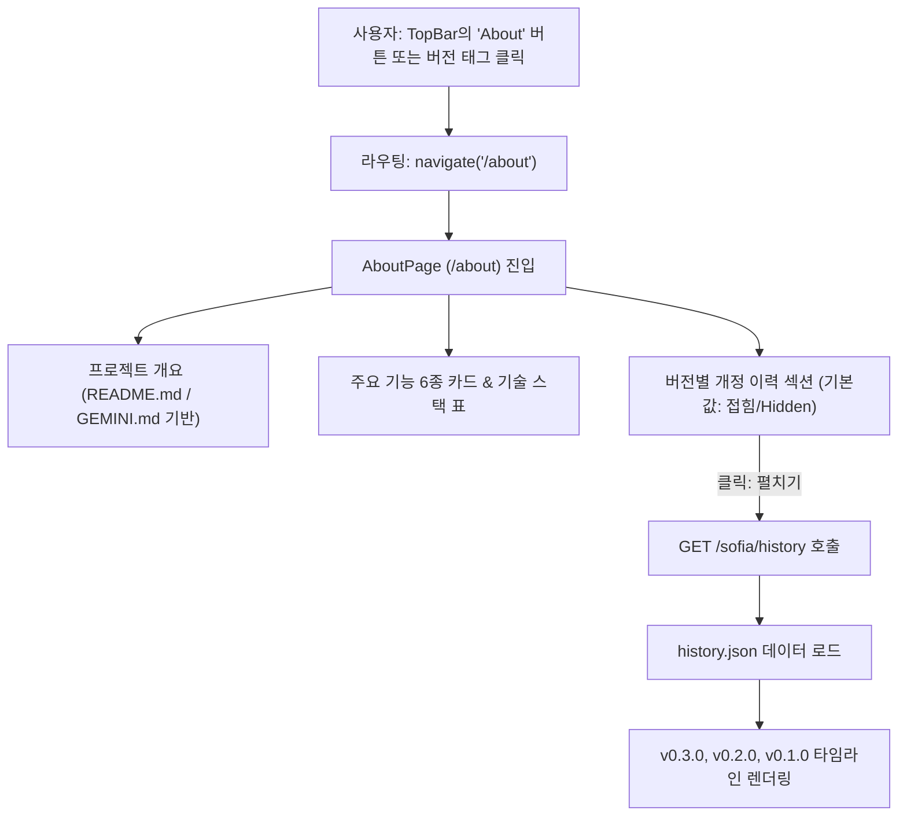

# About 페이지(`/about`) 및 버전별 변경 이력(history.json) 구현 계획서

## 🎯 목표 개요 (Goal Description)
- 모달(팝업) 대신 **독립된 전용 페이지(`/about`)**를 신설하여 Sofia 2 시스템의 전체적인 정보와 기술 스택, 버전 히스토리를 쾌적한 전체 화면 레이아웃으로 제공합니다.
- `TopBar.tsx`에 **About 버튼** 및 버전 태그 클릭 이벤트를 연결하여 어디서든 `/about` 페이지로 쉽게 이동할 수 있게 합니다.
- `README.md` 및 `GEMINI.md`의 내용을 바탕으로 **프로젝트 개요, 핵심 기능 6종, 프론트/백엔드 기술 스택**을 세련된 카드 UI로 구성합니다.
- `backend/src/main/resources/history.json`에 버전별 수정사항을 기록하고 백엔드 API(`/sofia/history`)로 제공합니다.
- About 페이지 내에서 **버전별 개정 이력(Version History)** 섹션을 **초기에는 접어두고(hidden)**, 사용자가 클릭하면 부드럽게 펼쳐지며(collapsible) 버전별 상세 수정 내용을 확인할 수 있도록 구현합니다.

---

## 🔍 사용자 검토 필요 사항 (User Review Required)

> [!NOTE]
> **모달 팝업 $\rightarrow$ 독립 1페이지(`/about`) 전환의 주요 이점**:
> 1. **가독성 및 공간 활용**: 좁은 모달 팝업 대신 넓은 페이지 레이아웃을 사용하여 기술 스택과 개정사항 타임라인을 훨씬 더 쾌적하게 읽을 수 있습니다.
> 2. **URL 다이렉트 접근**: `http://localhost:5173/about` 또는 `/sofia/about`으로 직접 접근 가능합니다.
> 3. **상단 네비게이션**: 상단에 뒤로가기(`ChevronLeft`) 버튼을 배치하여 이전 페이지(폴더 목록 또는 이미지 목록)로 손쉽게 돌아갈 수 있습니다.

> [!IMPORTANT]
> **버전별 개정 이력 (Collapsible UI)**:
> - 요구사항에 맞춰 **처음 진입 시에는 히스토리 내용이 숨김(hidden/collapsed)** 처리됩니다.
> - "버전별 개정 이력 보기" 헤더 또는 토글 버튼을 클릭하면 화살표 애니메이션과 함께 펼쳐지며 백엔드 `history.json`의 내용이 타임라인 카드로 표시됩니다.

---

## ❓ 확인 사항 (Open Questions)

> [!TIP]
> - `application.properties`의 `sofia.version`을 최근 Merge & PDF 전면 개편을 반영하여 `0.3.0`으로 설정하고, `history.json`의 최신 버전과 동기화합니다.

---

## 🏗️ 아키텍처 및 라우팅 흐름



---

## 📂 제안 변경 사항 (Proposed Changes)

### 1. 백엔드 (Backend)

#### [NEW] `backend/src/main/resources/history.json`
- 버전별 개정 내역을 관리하는 JSON 파일:
```json
[
  {
    "version": "0.3.0",
    "date": "2026-09-07",
    "title": "PDF 만들기 전면 개편 및 세로/가로 레이아웃 고도화",
    "changes": [
      "PDF 내보내기 전용 모달(PdfOptionsModal) 구현",
      "용지 방향(스마트 자동/세로/가로) 및 3장(2+1) 가로 꽉 채움 레이아웃 지원",
      "PDFBox 초고화질 벡터 테두리선(addRect + stroke) 렌더링 지원",
      "임시 파일 디스크 I/O를 제거한 메모리 스트리밍 렌더링 파이프라인 적용"
    ]
  },
  {
    "version": "0.2.0",
    "date": "2026-09-07",
    "title": "Merge (이미지 병합) 기능 전면 개편",
    "changes": [
      "사각형 형태 채움 및 하얀 여백 0% 원칙의 tight-fit 알고리즘 적용",
      "테두리선(유무, 두께 1~4px, 색상 팔레트 및 컬러피커) 지원",
      "Row당 이미지 갯수(1~4), 기준 너비(A4, 원본유지, 1900, 직접입력), X/Y 간격 선택 기능",
      "전용 병합 옵션 모달(MergeOptionsModal) 구현"
    ]
  },
  {
    "version": "0.1.0",
    "date": "2026-09-01",
    "title": "Sofia 2 초기 릴리즈 (Spring Boot + React 리뉴얼)",
    "changes": [
      "기존 Python FastAPI 스택을 Spring Boot 3.4 및 React 19로 전면 재작성",
      "폴더 및 이미지 파일 스캐닝, PostgreSQL JPA 메타데이터 연동",
      "JWT 기반 HttpOnly 쿠키 인증 및 북마크 시스템 구축",
      "AG Grid 기반 고성능 리스트 뷰 및 반응형 썸네일 그리드 뷰어 지원"
    ]
  }
]
```

#### [MODIFY] `backend/src/main/java/kr/co/kalpa/sofia/controller/HealthController.java`
- `@GetMapping("/history")` 추가: `history.json` 리소스를 읽어 반환.

#### [MODIFY] `backend/src/main/java/kr/co/kalpa/sofia/security/WebSecurityConfig.java`
- `.requestMatchers("/about", "/history").permitAll()` 추가.

#### [MODIFY] `backend/src/main/resources/application.properties`
- `sofia.version=0.3.0`으로 버전 갱신.

---

### 2. 프론트엔드 (Frontend)

#### [NEW] `frontend/src/domain/about/AboutPage.tsx`
- **1페이지 전체 레이아웃**:
  - **헤더**: 뒤로가기 버튼, Sofia 2 로고, 버전 뱃지, 프로젝트 슬로건
  - **소개 카드**: FastAPI $\rightarrow$ Spring Boot/React 스택 전환 배경 및 아키텍처 소개
  - **핵심 기능 그리드**:
    1. 스마트 폴더 관리 & DB 동기화
    2. 고성능 뷰어 (AG Grid & 썸네일 그리드)
    3. 스마트 이미지 병합 (Merge tight-fit)
    4. 고화질 벡터 PDF 내보내기
    5. 북마크 및 실시간 검색
    6. 무손실 회전 및 EXIF 메타데이터
  - **기술 스택 표/태그**: Frontend & Backend 주요 라이브러리 및 역할 정리
  - **버전별 개정 이력 (Collapsible Section)**:
    - 처음에는 접힘(hidden) 상태 (`[ 펼치기 / 접기 ]` 버튼)
    - 클릭 시 펼쳐지며 타임라인 형태로 v0.3.0, v0.2.0, v0.1.0 세부 수정 항목 표시

#### [MODIFY] `frontend/src/App.tsx`
- `<Route path="/about" element={<AboutPage />} />` 라우트 등록.

#### [MODIFY] `frontend/src/shared/layout/TopBar.tsx`
- 상단 로고 버전 태그 클릭 시 `/about`으로 이동
- 데스크탑 네비게이션에 `About` 버튼 추가 (`<Info size={16} /> About`)
- 모바일 햄버거 메뉴에 `About (Sofia 정보)` 항목 추가

---

## 🧪 검증 계획 (Verification Plan)

### 자동화 테스트 및 코드 품질
```bash
./bm.sh lint
./bm.sh build
./fm.sh lint
./fm.sh build
```

### 수동 검증 시나리오
1. **페이지 이동 확인**:
   - TopBar의 `About` 버튼 클릭 시 `/about` 페이지로 정상 이동
   - 브라우저 뒤로가기 또는 상단 '이전' 버튼 클릭 시 이전 화면으로 정상 복귀
2. **소개 내용 확인**:
   - README.md / GEMINI.md 바탕의 시스템 개요 및 기술 스택이 1페이지로 깔끔하게 표시되는지 확인
3. **개정사항(Version History) 토글 확인**:
   - 페이지 진입 시 개정사항 내용이 접혀 있는지(hidden) 확인
   - 토글 버튼 클릭 시 부드럽게 펼쳐지며 백엔드 `history.json`의 v0.3.0, v0.2.0, v0.1.0 데이터가 정상 렌더링되는지 확인
