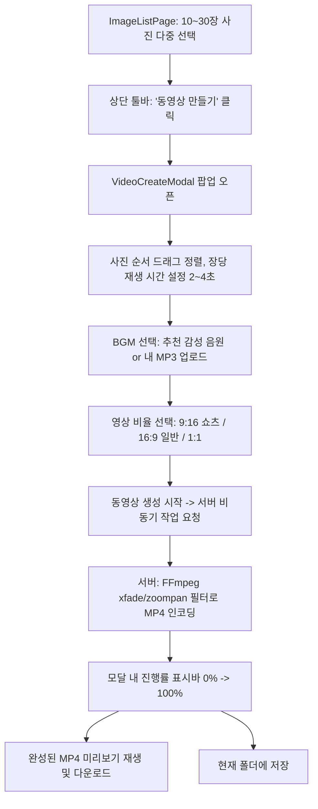

# 사진 슬라이드쇼 동영상(BGM 포함) 제작 기능 구현 계획

## Goal Description
사용자가 데이트, 여행, 일상 등에서 촬영한 **10~30장의 사진을 선택**하여, **감성적인 배경음악(BGM)**과 **부드러운 화면 전환 효과(Crossfade, 줌인/줌아웃 Ken Burns 효과)**가 곁들여진 **고화질 MP4 동영상**(인스타그램 릴스/유튜브 쇼츠용 세로 9:16 또는 가로 16:9)을 자동으로 제작하는 기능의 구현 설계입니다.

서버 환경 점검 결과, Linux 호스트에 최신 **FFmpeg n9.0.1**이 이미 완벽히 설치되어 있으며 `libx264`, `libmp3lame`, `aac` 및 다양한 비디오 필터(`xfade`, `zoompan`)를 지원하고 있어 **별도의 무거운 외부 서비스 없이 100% 자체 구현이 가능**합니다.

---

## User Review Required

> [!IMPORTANT]
> **핵심 아키텍처: 서버 사이드 FFmpeg 렌더링**
> - **방식**: 프론트엔드에서 사진 순서, 전환 효과, BGM(기본 제공곡 또는 사용자 MP3), 영상 비율(9:16 / 16:9)을 선택하면, 백엔드 Spring Boot가 서버의 FFmpeg 프로세스를 실행하여 고화질 MP4를 생성합니다.
> - **장점**: 모바일이나 저사양 PC에서도 기기 발열이나 브라우저 다운 없이 초고속(10~30장 기준 수 초~십수 초 내외)으로 1080p 고화질 MP4가 인코딩됩니다.

> [!NOTE]
> **배경음악(BGM) 제공 방식**
> 1. **기본 프리셋 음원**: 서버에 저작권 없는 감성 어쿠스틱 / 밝은 팝 / 잔잔한 피아노 등 3~5곡의 무료 음원 기본 탑재.
> 2. **사용자 직접 첨부**: 사용자가 원하는 MP3 파일을 직접 업로드하여 영상 배경음악으로 지정 가능.
> 3. **오디오 페이드아웃**: 사진 슬라이드가 끝나는 시점에 맞춰 음악이 자연스럽게 줄어들도록(Fade-out) 자동 처리.

---

## Open Questions

> [!QUESTION]
> 1. **생성된 동영상 결과물의 저장 방식**:
>    - 옵션 1: 완료 즉시 웹 브라우저에서 **MP4 파일로 직접 다운로드**.
>    - 옵션 2: 다운로드뿐만 아니라 **현재 보고 있는 Sofia 폴더에 `.mp4` 파일로 저장**하여 웹에서도 바로 재생/보관 가능하게 지원.
> 2. **영상 화면비(Aspect Ratio) 기본값**:
>    - 모바일/SNS 공유용 **세로 9:16 (1080x1920)** vs TV/모니터용 **가로 16:9 (1920x1080)** 중 선호하시는 방향. (둘 다 선택 옵션으로 제공 가능)

---

## Architecture & Video Pipeline

### 1. 동영상 제작 워크플로우

### 2. FFmpeg 파이프라인 핵심 기술 (Ken Burns & Crossfade)

정적인 사진을 단순 이어붙이면 지루할 수 있으므로, 구글 포토/애플 포토 스타일의 감성적인 연출을 적용합니다:
- **Ken Burns 효과 (`zoompan` 필터)**: 사진이 천천히 확대되거나 위/아래로 부드럽게 이동하는 효과.
- **크로스페이드 (`xfade` 필터)**: 사진이 다음 사진으로 넘어갈 때 0.5~1.0초간 겹치며 부드럽게 전환(Dissolve).
- **자동 레터박스/블러 배경**: 세로 사진과 가로 사진이 섞여 있을 때 검은 여백 대신 흐릿한 배경 블러(Blur Pad) 처리.
- **오디오 믹싱 (`afade`)**: 비디오 총 길이에 맞춰 오디오를 자르고 마지막 2초간 서서히 볼륨 감소.

---

## Proposed Changes

### Backend (`/backend`)

#### [NEW] `src/main/java/kr/co/kalpa/sofia/service/VideoService.java`
- FFmpeg 프로세스 빌더(`ProcessBuilder`) 래퍼 구현
- 사진 목록, 종횡비, 장당 재생 시간, BGM 경로를 받아 FFmpeg 명령어 생성 및 실행
- FFmpeg 진행 로그(`time=...`)를 파싱하여 `taskProgressMap`에 실시간 진행률(0%~100%) 반영

#### [NEW] `src/main/java/kr/co/kalpa/sofia/controller/VideoController.java`
- `POST /api/videos/create`: 동영상 생성 작업 시작 (비동기 taskId 반환)
- `GET /api/videos/progress/{taskId}`: 실시간 인코딩 진행률 조회
- `GET /api/videos/download/{taskId}`: 완성된 MP4 스트리밍/다운로드
- `POST /api/videos/save-to-folder`: 완성된 비디오를 현재 폴더에 등록

#### [NEW] `backend/src/main/resources/static/bgm/`
- 저작권 프리 BGM 3~4곡 기본 배치 (예: `acoustic_breeze.mp3`, `sunny_days.mp3`, `calm_memory.mp3`)

---

### Frontend (`/frontend`)

#### [NEW] `src/domain/folder/components/video/VideoCreateModal.tsx`
- **사진 썸네일 스트립**: 선택한 10~30장의 사진 순서 확인 및 드래그 앤 드롭 순서 변경
- **재생 설정**:
  - 사진 1장당 노출 시간 (2초, 3초, 4초, 5초)
  - 전환 효과 (부드러운 디졸브, 줌인 켄번스, 심플 페이드)
- **비율 설정**: 9:16 (릴스/쇼츠), 16:9 (일반), 1:1 (정사각형)
- **음악 설정**: 추천 BGM 목록(미리듣기 재생 버튼 포함) 또는 "내 MP3 파일 업로드"
- **진행률 모달**: "동영상 인코딩 중... (45%)" 프로그레스바 표시
- **미리보기 플레이어**: 완성 후 즉시 브라우저 HTML5 `<video>` 태그로 재생 및 "다운로드 / 폴더에 저장" 버튼 제공

#### [MODIFY] `src/domain/folder/components/ListToolbar.tsx`
- 다중 선택 시 표시되는 액션 메뉴에 `동영상 만들기 (비디오)` 버튼 추가 (아이콘: `Video` or `Film`)

---

## Verification Plan

### Automated Tests
- `./bm.sh test` 및 `npm run build` 빌드 안정성 검증

### Manual Verification
1. **사진 선택 및 진입**:
   - 폴더에서 사진 10장 선택 후 "동영상 만들기" 클릭 -> 모달 정상 오픈
2. **설정 및 BGM 테스트**:
   - 기본 제공 BGM 미리듣기 재생 확인
   - 사용자 MP3 업로드 시 오디오 연동 확인
3. **인코딩 성능 및 결과 확인**:
   - 10장~30장 사진 생성 요청 시 서버 FFmpeg 정상 구동 확인
   - 진행률 100% 도달 후 모달 내에서 음악과 함께 영상이 부드럽게 재생되는지 확인
   - 다운로드받은 MP4 파일이 스마트폰 및 PC 미디어 플레이어에서 정상 재생되는지 확인
