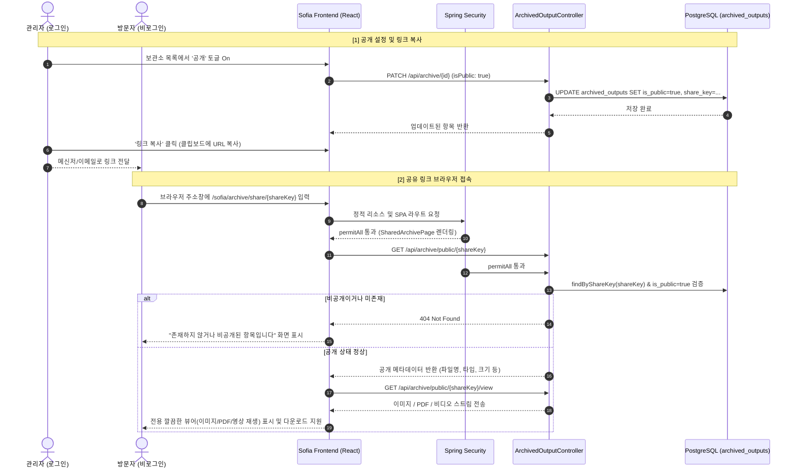

# 보관소 항목 공개 여부 설정 및 공유 링크 접근 기능 구현 계획

## Goal Description
보관소(`ArchivedOutput`)에 저장된 작업 산출물(이미지 병합, PDF, 콜라주, 효과, 슬라이드쇼 동영상)에 대해 **개별 공개(Public) 여부**를 설정할 수 있도록 데이터베이스 및 백엔드/프론트엔드를 확장합니다.  
공개로 설정된 항목은 **고유한 공유 링크(Share Link)**를 생성하여 타인에게 전달할 수 있으며, 링크를 받은 사용자는 **로그인 없이도 브라우저 주소창을 통해 해당 파일(이미지, PDF, 동영상)을 바로 열람하고 다운로드**할 수 있는 전용 뷰어 페이지를 제공합니다.

---

## User Review Required

> [!IMPORTANT]
> **공유 링크 식별자 방식 (UUID 난수 토큰 권장)**
> * 단순 숫자 ID(예: `/archive/share/12`)를 사용할 경우 번호만 1씩 올려가며 다른 사람의 공개 보관물들을 쉽게 열람/크롤링할 수 있는 보안 취약점이 생깁니다.
> * 따라서 본 계획에서는 Google Drive, Notion 등과 같이 **추측 불가능한 고유 난수 키(`shareKey`: UUID v4)** 방식을 적용합니다.
>   * 링크 형태: `http://<도메인>/sofia/archive/share/550e8400-e29b-41d4-a716-446655440000`
>   * `isPublic`이 `false`(비공개)로 전환되면 해당 링크로의 접근이 즉시 차단됩니다.

> [!NOTE]
> **접근 권한 및 Spring Security 설정**
> * 공유 뷰어 페이지(`/sofia/archive/share/**`) 및 공개 조회 API(`/sofia/api/archive/public/**`)는 **비로그인 사용자(익명)**에게도 열려 있어야 하므로, `WebSecurityConfig`의 `permitAll()`에 등록됩니다.
> * 공개 토글/수정/삭제 등의 관리 작업은 기존과 동일하게 로그인된 사용자만 가능합니다.

---

## Architecture & Data Flow



---

## Proposed Changes

### 1. Database & Backend Domain Layer

#### [MODIFY] `backend/src/main/java/kr/co/kalpa/sofia/domain/ArchivedOutput.java`
* `isPublic` (boolean, 기본값 false) 필드 추가.
* `shareKey` (String, length=64, unique=true, nullable=false) 필드 추가.
* `@PrePersist`에서 `shareKey`가 없을 경우 `UUID.randomUUID().toString()` 자동 생성.

```java
@Column(nullable = false)
@Builder.Default
private Boolean isPublic = false;

@Column(nullable = false, unique = true, length = 64)
private String shareKey;

@PrePersist
void prePersist() {
    if (createdAt == null) createdAt = LocalDateTime.now();
    if (isPublic == null) isPublic = false;
    if (shareKey == null || shareKey.isBlank()) {
        shareKey = java.util.UUID.randomUUID().toString();
    }
}
```

#### [MODIFY] `backend/src/main/java/kr/co/kalpa/sofia/dto/ArchivedOutputUpdateRequest.java`
* `isPublic` 필드 추가 (클라이언트에서 공개 여부 수정 가능하도록 확장).

```java
public class ArchivedOutputUpdateRequest {
    private String note;
    private String displayFilename;
    private Boolean isPublic;
}
```

#### [MODIFY] `backend/src/main/java/kr/co/kalpa/sofia/repository/ArchivedOutputRepository.java`
* `Optional<ArchivedOutput> findByShareKey(String shareKey);` 쿼리 메서드 추가.
* `Optional<ArchivedOutput> findByShareKeyAndIsPublicTrue(String shareKey);` 추가.

---

### 2. Backend Service & Controller Layer

#### [MODIFY] `backend/src/main/java/kr/co/kalpa/sofia/service/ArchivedOutputService.java`
* `updateMeta(Long id, String note, String displayFilename, Boolean isPublic)` 메서드로 확장:
  * `isPublic` 값 변경 지원.
  * 필요 시 `shareKey`가 비어있는 기존 데이터를 위해 자동 생성 보완.
* 공개 조회용 메서드 추가:
  * `getPublicMeta(String shareKey)`: `isPublic == true`인 항목만 반환 (없으면 404 예외).
  * `getPublicFile(String shareKey)`: 공개 항목의 실제 파일 `Resource` 반환.

#### [MODIFY] `backend/src/main/java/kr/co/kalpa/sofia/controller/ArchivedOutputController.java`
* 기존 `updateMeta` 엔드포인트에서 `request.getIsPublic()` 반영.
* 공개 전용 엔드포인트 추가 (비로그인 공개 API):
  * `GET /api/archive/public/{shareKey}`: 파일 메타데이터 반환 (파일명, 종류, 크기, 메모 등).
  * `GET /api/archive/public/{shareKey}/view`: 브라우저 인라인 렌더링용 스트림 (이미지, 비디오, PDF).
  * `GET /api/archive/public/{shareKey}/download`: 파일 다운로드 스트림.

#### [MODIFY] `backend/src/main/java/kr/co/kalpa/sofia/security/WebSecurityConfig.java`
* 익명 사용자 접근 허용 규칙(`permitAll`) 추가:
  * SPA 라우트: `"/archive/share/**"`
  * 백엔드 API: `"/api/archive/public/**"`

---

### 3. Frontend Implementation

#### [MODIFY] `frontend/src/domain/archive/ArchiveListPage.tsx`
* `ArchivedOutput` 인터페이스에 `isPublic: boolean`, `shareKey: string` 필드 추가.
* AG Grid에 2개 컬럼 추가/개선:
  1. **공개 여부 토글 컬럼**:
     * 스위치 또는 원클릭 배지 버튼 (초록색 `공개` / 회색 `비공개`).
     * 클릭 시 즉시 `updateMutation` 호출하여 `isPublic` 토글.
  2. **링크 복사 컬럼**:
     * 링크 아이콘 버튼 (`Link` / `Share2`).
     * `isPublic`이 `true`일 때 활성화 -> 클릭 시 `window.location.origin + '/sofia/archive/share/' + item.shareKey` 클립보드 복사 + 성공 토스트.
     * `isPublic`이 `false`일 때 비활성화(흐린 색) 또는 클릭 시 "공개 상태로 먼저 변경해주세요" 툴팁/안내.

#### [NEW] `frontend/src/domain/archive/SharedArchivePage.tsx`
* 비로그인 외부 방문자를 위한 단독 전용 뷰어 페이지:
  * 상단: 깔끔한 브랜드 헤더 ("SOFIA 보관소" 및 파일 기본 정보).
  * 본문:
    * **이미지 (`MERGE`, `COLLAGE`, `EFFECT`)**: 반응형 고화질 뷰어 (중앙 배치, 카드 섀도우).
    * **PDF (`PDF`)**: 브라우저 내장 PDF 뷰어 프레임(`iframe` 또는 `embed`) 및 전체화면 열기 지원.
    * **슬라이드쇼 (`SLIDESHOW`)**: 커스텀 비디오 플레이어 컨트롤 (`<video controls autoPlay>`).
  * 하단 정보 패널:
    * 파일명, 등록일자, 파일 용량, 관리자 메모(note가 있을 경우 블록 인용구로 표시).
    * [다운로드] 버튼 (클릭 시 `/api/archive/public/{shareKey}/download` 트리거).
  * 에러/비공개 상태 처리:
    * 항목이 없거나 비공개(`404`)일 경우 자물쇠/경고 아이콘과 함께 "존재하지 않거나 비공개로 전환된 공유 링크입니다." 친절 안내 화면 렌더링.

#### [MODIFY] `frontend/src/App.tsx`
* `ProtectedLayout` 바깥에 공개 공유 라우트 등록:
  ```tsx
  <Route path="/archive/share/:shareKey" element={<SharedArchivePage />} />
  ```

---

## Verification Plan

### Automated Tests
1. **백엔드 빌드 및 컴파일 검증**:
   ```bash
   ./bm.sh build
   ```
2. **프론트엔드 린트 및 프로덕션 빌드**:
   ```bash
   ./fm.sh lint
   ./fm.sh build
   ```

### Manual Verification
1. **보관소 목록 확인**:
   * 보관소 페이지(`/sofia/archive`) 접속.
   * 각 행에 `공개/비공개` 토글 및 `링크 복사` 버튼이 정상 렌더링되는지 확인.
2. **공개 토글 테스트**:
   * 비공개 상태인 항목을 '공개'로 토글 -> DB에 `is_public = true` 정상 반영 확인.
   * '링크 복사' 버튼 클릭 -> 클립보드에 올바른 URL 복사 및 성공 토스트 확인.
3. **외부 브라우저(시크릿 창 / 비로그인) 접속 테스트**:
   * 시크릿 창(Incognito)을 열고 복사한 링크(`http://<host>/sofia/archive/share/<shareKey>`) 접속.
   * 로그인 창으로 리다이렉트되지 않고, 전용 공유 뷰어 화면이 정상 노출되는지 확인.
   * 이미지, PDF, 동영상이 타입별로 잘 재생/렌더링되는지 확인.
   * 다운로드 버튼 클릭 시 파일이 정상 다운로드되는지 확인.
4. **비공개 차단 테스트**:
   * 관리자 화면에서 다시 해당 항목을 '비공개'로 토글.
   * 시크릿 창에서 공유 링크 새로고침 -> 즉시 404 / "비공개 전환 안내" 화면이 뜨고 파일 접근이 차단되는지 확인.
