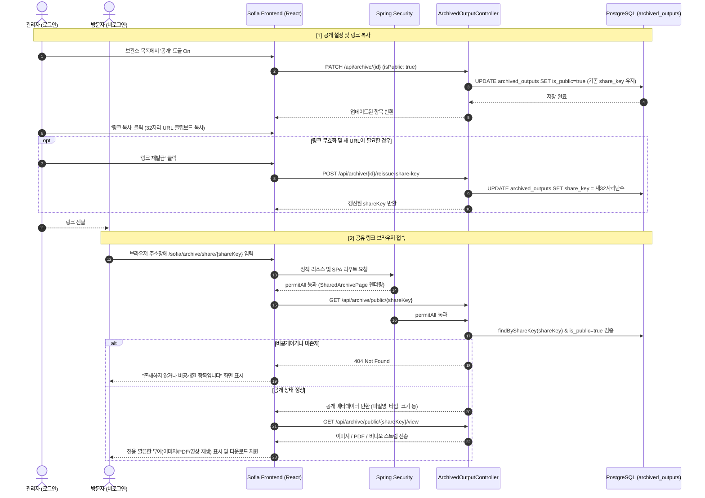

# 보관소 항목 공개 여부 설정 및 공유 링크 접근 기능 구현 계획

## Goal Description
보관소(`ArchivedOutput`)에 저장된 작업 산출물(이미지 병합, PDF, 콜라주, 효과, 슬라이드쇼 동영상)에 대해 **개별 공개(Public) 여부**를 설정할 수 있도록 데이터베이스 및 백엔드/프론트엔드를 확장합니다.  
공개로 설정된 항목은 **고유한 공유 링크(Share Link)**를 생성하여 타인에게 전달할 수 있으며, 링크를 받은 사용자는 **로그인 없이도 브라우저 주소창을 통해 해당 파일(이미지, PDF, 동영상)을 바로 열람하고 다운로드**할 수 있는 전용 뷰어 페이지를 제공합니다.

---

## 사용자 피드백 및 정책 결정 (User Review Required)

### 1. 공유 키 형식 (`-` 하이픈 제거)
* UUID에서 하이픈(`-`)을 제거한 **32자리 깔끔한 16진수 문자열**을 사용합니다.
* 생성 방식: `UUID.randomUUID().toString().replace("-", "")`
* 링크 형태:
  ```text
  http://<도메인>/sofia/archive/share/550e8400e29b41d4a716446655440000
  ```

### 2. 링크 유효기간 (만료 정책)
* **기본 정책: 무기한(영구) 유효**
  * 사용자가 관리자 화면에서 해당 항목을 **'비공개'**로 전환하거나, 보관소에서 항목을 **'삭제'**하기 전까지는 링크가 영구적으로 유지됩니다.
  * 비공개로 전환하는 순간부터는 해당 링크로 접근하더라도 즉시 차단(404 / 접근 불가 안내)됩니다.

### 3. 비공개 전환 후 재공개 시 URL 정책 (하이브리드 방식 권장)
* **기본 동작**: 비공개로 변경했다가 다시 공개로 전환해도 **기존 URL(`shareKey`)이 그대로 유지**됩니다.
  * *이유*: 이미 메신저나 이메일로 링크를 전달해 둔 상태에서 잠시 비공개로 닫았다가 다시 열었을 때, 기존 상대방이 동일한 링크로 다시 접속할 수 있어 편리합니다.
* **추가 지원 (링크 재발급 / 초기화 버튼)**:
  * 기존 링크를 받은 사람이 더 이상 접속하지 못하도록 완전히 새로운 링크로 바꾸고 싶은 경우를 위해, 관리자 화면에서 **[새 링크로 재발급]** 기능을 함께 제공합니다.
  * 재발급을 누르면 즉시 새로운 32자리 `shareKey`가 생성되어 이전 링크는 완전히 무효화됩니다.

---

## Architecture & Data Flow



---

## Proposed Changes

### 1. Database & Backend Domain Layer (안전한 자동 마이그레이션)

Spring Boot의 `spring.jpa.hibernate.ddl-auto=update` 설정 덕분에 `./deploy.sh` 실행 시 **Hibernate가 자동으로 `ALTER TABLE`을 실행하여 새 컬럼을 생성**합니다.  
다만, **기존에 저장된 보관소 데이터(현재 6건)**가 존재하므로 `NOT NULL` 충돌 없이 100% 안전하게 자동 반영되도록 다음과 같이 설계합니다:

#### [MODIFY] `backend/src/main/java/kr/co/kalpa/sofia/domain/ArchivedOutput.java`
* `isPublic`: 기본값 `false`를 DDL 레벨(`columnDefinition = "boolean default false"`)에 지정하여 기존 행들도 즉시 `false`로 자동 채워짐.
* `shareKey`: 32자리 유니크 키. 기존 행들을 위해 엔티티 선언 단계에서 유연하게 추가된 후 구동 시 자동 초기화.

```java
@Column(name = "is_public", nullable = false, columnDefinition = "boolean default false")
@Builder.Default
private Boolean isPublic = false;

@Column(name = "share_key", length = 32, unique = true)
private String shareKey;

@PrePersist
void prePersist() {
    if (createdAt == null) createdAt = LocalDateTime.now();
    if (isPublic == null) isPublic = false;
    if (shareKey == null || shareKey.isBlank()) {
        shareKey = java.util.UUID.randomUUID().toString().replace("-", "");
    }
}
```

#### [MODIFY] `backend/src/main/java/kr/co/kalpa/sofia/service/ArchivedOutputService.java` (기존 데이터 자동 보정)
* 서버 시작 시 `@PostConstruct`의 `init()` 메서드에서:
  * 기존 행 중 `shareKey`가 없는 행들을 조회하여 고유한 32자리 난수 키를 자동으로 발급/저장합니다.
  * 따라서 **수동 SQL 작업 전혀 없이 `./deploy.sh` 배포 한 번으로 신규 컬럼 생성 + 기존 데이터 초기화가 완벽히 완료**됩니다.

#### [MODIFY] `backend/src/main/java/kr/co/kalpa/sofia/dto/ArchivedOutputUpdateRequest.java`
* `isPublic` 필드 추가 (공개/비공개 토글 지원).

```java
public class ArchivedOutputUpdateRequest {
    private String note;
    private String displayFilename;
    private Boolean isPublic;
}
```

#### [MODIFY] `backend/src/main/java/kr/co/kalpa/sofia/repository/ArchivedOutputRepository.java`
* `Optional<ArchivedOutput> findByShareKey(String shareKey);` 추가.
* `Optional<ArchivedOutput> findByShareKeyAndIsPublicTrue(String shareKey);` 추가.

---

### 2. Backend Service & Controller Layer

#### [MODIFY] `backend/src/main/java/kr/co/kalpa/sofia/service/ArchivedOutputService.java`
* `updateMeta(Long id, String note, String displayFilename, Boolean isPublic)` 메서드로 확장:
  * `isPublic` 값 변경 지원.
  * 기존 데이터에 `shareKey`가 없는 경우 32자리 하이픈 없는 UUID 자동 발급.
* `reissueShareKey(Long id)` 신규 메서드:
  * 새 32자리 `shareKey`를 생성하여 DB 업데이트 후 반환.
* 공개 조회용 메서드 추가:
  * `getPublicMeta(String shareKey)`: `isPublic == true`인 항목만 조회.
  * `getPublicFile(String shareKey)`: 공개 항목의 실제 파일 `Resource` 반환.

#### [MODIFY] `backend/src/main/java/kr/co/kalpa/sofia/controller/ArchivedOutputController.java`
* 기존 `PATCH /api/archive/{id}`: `request.getIsPublic()` 반영.
* `POST /api/archive/{id}/reissue-share-key`: 새 공유 키 재발급 엔드포인트.
* 비로그인 공개 전용 엔드포인트:
  * `GET /api/archive/public/{shareKey}`: 메타데이터 반환 (파일명, 타입, 크기, 메모 등).
  * `GET /api/archive/public/{shareKey}/view`: 브라우저 인라인 뷰 (이미지, 비디오, PDF).
  * `GET /api/archive/public/{shareKey}/download`: 파일 다운로드 스트림.

#### [MODIFY] `backend/src/main/java/kr/co/kalpa/sofia/security/WebSecurityConfig.java`
* 익명 사용자 접근 허용 규칙(`permitAll`) 추가:
  * SPA 라우트: `"/archive/share/**"`
  * 백엔드 API: `"/api/archive/public/**"`

---

### 3. Frontend Implementation

#### [MODIFY] `frontend/src/domain/archive/ArchiveListPage.tsx`
* `ArchivedOutput` 인터페이스에 `isPublic: boolean`, `shareKey: string` 필드 반영.
* AG Grid 컬럼 추가 및 UI 구성:
  1. **공개 여부 컬럼**:
     * 원클릭 토글 배지 버튼 (공개 중: 초록색 `공개`, 비공개 중: 회색 `비공개`).
     * 클릭 시 즉시 `updateMutation`으로 `isPublic` 토글.
  2. **공유 링크 컬럼**:
     * `isPublic`이 `true`일 때:
       * **[링크 복사]** 버튼: 클릭 시 `window.location.origin + '/sofia/archive/share/' + item.shareKey` 클립보드 복사 및 성공 토스트.
       * **[재발급]** 작은 아이콘 버튼: 클릭 시 확인 팝업 후 새 링크로 갱신.
     * `isPublic`이 `false`일 때:
       * 비활성화 및 "공개로 전환 후 링크 복사 가능" 안내 툴팁.

#### [NEW] `frontend/src/domain/archive/SharedArchivePage.tsx`
* 비로그인 방문자를 위한 반응형 전용 뷰어 페이지:
  * 상단: 심플하고 모던한 네비게이션 바 ("SOFIA ARCHIVE", 파일명).
  * 본문:
    * **이미지 (`MERGE`, `COLLAGE`, `EFFECT`)**: 고화질 반응형 뷰어.
    * **PDF (`PDF`)**: 모바일/PC 호환 PDF 뷰어 프레임 및 전체화면 버튼.
    * **슬라이드쇼 (`SLIDESHOW`)**: MP4 비디오 플레이어 (`<video controls autoPlay>`).
  * 하단:
    * 파일 메타정보 (용량, 생성일, 관리자 메모).
    * [다운로드] 버튼 (클릭 시 공개 다운로드 API 호출).
  * 404 / 비공개 상태 대응:
    * 자물쇠 아이콘과 함께 "존재하지 않거나 비공개로 전환된 공유 링크입니다." 안내 화면.

#### [MODIFY] `frontend/src/App.tsx`
* `ProtectedLayout` 바깥에 라우트 추가:
  ```tsx
  <Route path="/archive/share/:shareKey" element={<SharedArchivePage />} />
  ```

---

## Verification Plan

### Automated Tests
```bash
./bm.sh build
./fm.sh lint
./fm.sh build
```

### Manual Verification
1. **보관소 목록 확인 및 공개 토글**:
   * 항목을 '공개'로 설정 시 초록색 배지 전환 확인.
   * '링크 복사' 클릭 시 하이픈 없는 32자리 URL이 복사되는지 확인.
2. **비로그인 브라우저 열람**:
   * 시크릿 창에 해당 URL 접속 -> 이미지/PDF/동영상이 정상적으로 보여지는지 확인.
   * 다운로드 버튼 동작 확인.
3. **비공개 전환 테스트**:
   * 관리자 화면에서 '비공개'로 변경 -> 시크릿 창 새로고침 시 즉시 차단 화면 노출 확인.
4. **재공개 테스트**:
   * 다시 '공개'로 변경 -> 기존 링크로 접속 시 다시 정상 노출되는지 확인.
5. **링크 재발급 테스트**:
   * [새 링크 재발급] 클릭 -> 새로운 32자리 키가 생성되고 이전 링크는 차단되며 새 링크로만 접속되는지 확인.
