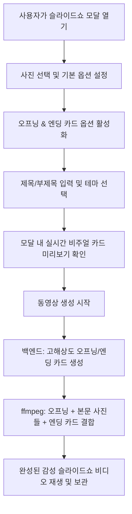

# [계획서] 슬라이드쇼 오프닝 & 엔딩 타이틀 카드 기능 구현 계획

## 1. 개요 (Goal Description)
슬라이드쇼 생성 시 시작(오프닝)과 끝(엔딩)에 감성적이고 화사하게 디자인된 **1장의 타이틀 카드 이미지(Intro & Outro Title Cards)**를 옵션으로 생성하여 영상에 자동으로 포함시키는 기능을 개발합니다.

- **오프닝 카드 예시**: `2025년 <김경남> 님 산티아고 순례길` / 서브: `발걸음마다 새겨진 소중한 추억들`
- **엔딩 카드 예시**: `슬라이드가 끝났습니다` / 서브: `재밌게 보셨길 바라겠습니다`
- **화사한 데코레이션**: 밋밋한 단색 배경이 아닌, 5가지 프리셋 테마(골든 선셋, 에메랄드 포레스트, 미드나잇 오로라, 소프트 블라썸, 클래식 시네마)의 그라디언트 배경, 장식 프레임, 디바이더 라인, 드롭 섀도우 타이포그래피 적용.
- **실시간 미리보기**: 프론트엔드 모달([`SlideShowModal.tsx`](file:///home/kdy987/work/sofia2/frontend/src/domain/folder/components/SlideShowModal.tsx))에서 텍스트를 입력하고 테마를 바꿀 때 실시간으로 카드의 비주얼을 확인 가능.

---

## 2. 사용자 검토 필요 항목 (User Review Required)

> [!TIP]
> **기본값 및 동작 방식:**
> 1. 오프닝 및 엔딩 카드는 **선택 옵션(체크박스/토글)**으로 기본값은 사용자 편의에 따라 켜거나 끌 수 있습니다.
> 2. 오프닝 카드 기본 제목은 현재 폴더명이 있을 경우 `[폴더명]의 추억`, 없을 경우 `소중한 추억의 기록`으로 자동 제안됩니다.
> 3. 엔딩 카드 기본 문구는 요청하신 `슬라이드가 끝났습니다` / `재밌게 보셨길 바라겠습니다`로 기본 입력됩니다.
> 4. 화면 비율(`16:9 와이드`, `9:16 세로`, `1:1 정사각`)에 맞춰 카드 해상도가 완벽하게 동기화됩니다 (1920x1080, 1080x1920, 1080x1080).
> 5. 트랜지션 효과(크로스페이드 등)와 부드러운 켄 번스(Ken Burns) 줌 효과가 타이틀 카드에도 자연스럽게 적용되어 방송 인트로처럼 고급스러운 연출이 가능합니다.

---

## 3. 디자인 테마 프리셋 (Decorative Themes)

| 테마 ID | 테마 명 | 시각적 특징 | 추천 분위기 |
| :--- | :--- | :--- | :--- |
| `sunset` | **골든 선셋 (Golden Sunset)** | 웜 오렌지 ➔ 코랄 핑크 ➔ 딥 퍼플 그라디언트 + 골드 프레임 테두리 | 여행, 휴양지, 일몰, 가족 |
| `forest` | **에메랄드 포레스트 (Nature Forest)** | 싱그러운 틸 그린 ➔ 포레스트 그린 그라디언트 + 모던 화이트 보더 | 자연, 산책, 순례길, 힐링 |
| `midnight` | **미드나잇 오로라 (Midnight Gold)** | 딥 인디고 네이비 ➔ 오로라 퍼플 배경 + 은은한 별빛 보케 + 골드 액센트 | 파티, 야경, 기념일, 고급스러운 연출 |
| `blossom` | **소프트 블라썸 (Soft Blossom)** | 화사한 로즈 크림 ➔ 파스텔 피치 그라디언트 + 라운드 프레임 | 봄, 꽃, 아기, 결혼, 따뜻한 추억 |
| `vintage` | **클래식 시네마 (Classic Vintage)** | 앤틱 세피아 ➔ 다크 에스프레소 비네팅 + 클래식 세리프 보더 | 필름 사진, 흑백, 레트로, 추억 |

---

## 4. 상세 변경 예정 내용 (Proposed Changes)

### 1) 백엔드 (Backend)

#### [MODIFY] [`SlideShowRequest.java`](file:///home/kdy987/work/sofia2/backend/src/main/java/kr/co/kalpa/sofia/dto/SlideShowRequest.java)
- 오프닝 및 엔딩 카드 옵션 필드 추가:
```java
    // 오프닝 타이틀 카드 옵션
    @Builder.Default private Boolean enableIntro = false;
    private String introTitle;
    private String introSubtitle;
    @Builder.Default private String introTheme = "sunset";
    @Builder.Default private Double introDuration = 3.0;

    // 엔딩 클로징 카드 옵션
    @Builder.Default private Boolean enableOutro = false;
    private String outroTitle;
    private String outroSubtitle;
    @Builder.Default private String outroTheme = "sunset";
    @Builder.Default private Double outroDuration = 3.0;
```

---

#### [MODIFY] [`SlideShowService.java`](file:///home/kdy987/work/sofia2/backend/src/main/java/kr/co/kalpa/sofia/service/SlideShowService.java)
1. **타이틀 카드 이미지 렌더러 구현 (`generateTitleCardImage`)**:
   - Java `BufferedImage`와 `Graphics2D`를 활용하여 요청 해상도(`width`, `height`)에 맞춰 고해상도 PNG 생성.
   - 고품질 렌더링 힌트 (`RenderingHints.KEY_TEXT_ANTIALIASING_ON`, `KEY_ANTIALIASING_ON`, `KEY_INTERPOLATION_BICUBIC`).
   - 시스템 내 한글 폰트(`Noto Sans CJK KR`, `Noto Serif CJK KR`, `NanumGothic`, `SansSerif` 폴백)를 사용하여 글자 깨짐 방지.
   - 테마별 그라디언트 배경(`LinearGradientPaint`), 장식 프레임(더블 라인 및 코너 장식), 중앙 디바이더 선, 텍스트 그림자 렌더링.
2. **슬라이드 목록에 오프닝/엔딩 카드 통합**:
   - `enableIntro`가 `true`이고 `introTitle`이 존재하면, 시작 카드를 생성하여 `imagePaths` 및 `durations`의 맨 앞(index 0)에 삽입.
   - `enableOutro`가 `true`이고 `outroTitle`이 존재하면, 종료 카드를 생성하여 `imagePaths` 및 `durations`의 맨 뒤에 추가.
   - 기존의 ffmpeg 필터그래프 및 전환효과(Fade, Dissolve 등), BGM 싱크가 그대로 연결되어 오프닝 ➔ 본문 사진들 ➔ 엔딩으로 부드럽게 이어짐.

---

### 2) 프론트엔드 (Frontend)

#### [MODIFY] [`SlideShowModal.tsx`](file:///home/kdy987/work/sofia2/frontend/src/domain/folder/components/SlideShowModal.tsx)
1. **상태값 추가**:
   - `enableIntro`, `introTitle`, `introSubtitle`, `introTheme`
   - `enableOutro`, `outroTitle`, `outroSubtitle`, `outroTheme`
2. **UI 섹션 추가: '🎬 오프닝 & 엔딩 카드' 아코디언/패널**:
   - **오프닝 카드 토글 및 입력 폼**:
     - 제목 인풋: 예: `2025년 <김경남> 님 산티아고 순례길`
     - 부제목 인풋: 예: `함께한 소중한 기록들`
     - 테마 선택 칩 (5가지 프리셋)
   - **엔딩 카드 토글 및 입력 폼**:
     - 제목 인풋: 기본값 `슬라이드가 끝났습니다`
     - 부제목 인풋: 기본값 `재밌게 보셨길 바라겠습니다`
     - 테마 선택 칩
   - **실시간 비주얼 프리뷰 컴포넌트**:
     - 현재 선택된 화면비율(16:9, 9:16, 1:1)과 테마 그라디언트, 타이포그래피가 적용된 미니 카드를 탭(오프닝/엔딩)으로 즉시 확인 가능.
3. **요청 페이로드에 옵션 포함 및 서버 전송**.

---

## 5. 비주얼 프리뷰 구조 (Mermaid)



---

## 6. 검증 계획 (Verification Plan)

### Automated Tests & Build
1. `./bm.sh format` & `./bm.sh lint`: Java 코드 포맷 검사
2. `./fm.sh lint` & `./fm.sh build`: 프론트엔드 컴파일 및 빌드
3. `./bm.sh build`: 백엔드 빌드 및 WAR 패키징

### Manual Verification
1. 폴더 목록 또는 이미지 목록에서 여러 장의 사진을 선택 후 `슬라이드쇼 생성` 클릭
2. 모달에서 **'오프닝 카드'** 체크 ➔ `2025년 <김경남> 님 산티아고 순례길` 입력 ➔ `골든 선셋` 테마 선택 ➔ 프리뷰 확인
3. **'엔딩 카드'** 체크 ➔ `슬라이드가 끝났습니다` / `재밌게 보셨길 바라겠습니다` 입력 ➔ 프리뷰 확인
4. 16:9 와이드, 9:16 세로 비율 각각 생성 시 카드가 비율에 맞게 화사하게 렌더링되는지 확인
5. 생성된 동영상 재생 시:
   - 첫 3초간 오프닝 카드가 은은한 줌/페이드로 시작
   - 사진들이 음악에 맞춰 전환
   - 마지막 3초간 엔딩 카드가 나오며 부드럽게 마무리되는지 확인
