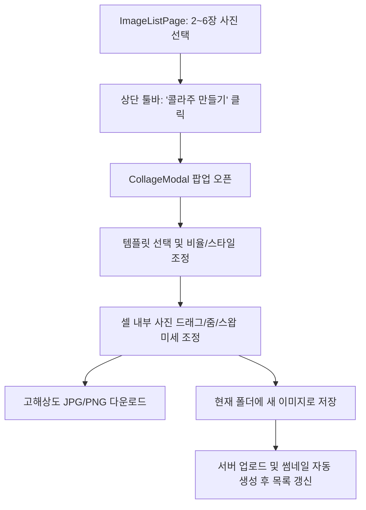

# 구글 포토 스타일 콜라주(Collage) 기능 구현 계획

## Goal Description
Sofia 2 이미지 관리 시스템에서 구글 포토(Google Photos)와 유사한 **사진 콜라주(Collage) 제작 기능**을 구현하는 것이 **충분히 가능**하며, 이를 프로젝트의 기존 스택(React 19 + Vite + Tailwind CSS + Spring Boot)에 최적화된 방식으로 도입하기 위한 기술 설계 및 구현 계획입니다.

현재 Sofia 2는 백엔드에서 격자 형태로 단순 합치는 `exportAsMergedImage` API를 가지고 있으나, 구글 포토 스타일의 진정한 콜라주는 다음 특성을 가집니다:
1. **사진 장수(2~6장)에 맞춘 세련된 매거진/모자이크 템플릿** 제공
2. **실시간 위지윅(WYSIWYG) 캔버스 인터랙션**: 각 셀 안에서 사진의 위치 이동(Pan) 및 확대/축소(Zoom/Crop), 사진 간 순서 교체(Swap)
3. **다양한 화면비(Aspect Ratio)**: 1:1(정사각형), 4:3, 3:4(세로), 16:9, 9:16(스토리/배경화면)
4. **스타일 커스텀**: 테두리 여백(Gap), 모서리 라운딩(Corner Radius), 배경색(화이트, 블랙, 파스텔 등)
5. **저장 및 다운로드**: 완성된 콜라주를 즉시 PC로 다운로드하거나 현재 폴더에 새 이미지(`ImageFile`)로 저장하여 바로 갤러리에서 감상

---

## User Review Required

> [!IMPORTANT]
> **콜라주 렌더링 엔진 아키텍처 선택**
> 
> **방안 A (추천: 브라우저 고해상도 HTML5 Canvas 기반 + 백엔드 업로드 연동)**
> - **장점**: 슬라이더 조작, 사진 드래그(Pan), 줌(Zoom) 시 60fps의 즉각적인 반응 속도 제공. 외부 추가 라이브러리 설치 없이 가볍고 빠른 동작. 완성된 이미지는 Canvas에서 고해상도(최대 4K급) Blob으로 렌더링한 뒤 Sofia의 기존 업로드 API(`/api/images/upload`)를 통해 현재 폴더에 저장하거나 즉시 다운로드 가능.
> - **백엔드 변경**: 필요 없음(기존 API 재활용) 또는 최소화.
> 
> **방안 B (하이브리드: 프론트 Canvas 프리뷰 + 백엔드 Graphics2D 최종 렌더링)**
> - **장점**: 원본 파일이 초고해상도(예: 8K, 40MB RAW/JPEG)일 때 브라우저 메모리 부담을 줄이고 백엔드 원본 파일에서 최종 렌더링.
> - **단점**: 백엔드에 셀 좌표/크롭 변환 계산 로직을 중복 구현해야 하며, 저장 시 서버 연산 지연 발생.
> 
> 👉 **권장**: 웹 뷰어 환경과 반응성을 고려할 때 **방안 A**가 사용자 경험(UX) 측면에서 압도적으로 우수합니다.

> [!NOTE]
> **지원 대상 사진 장수**
> 구글 포토와 동일하게 **최소 2장 ~ 최대 6장**(선택 시 템플릿 4~6종 제공)을 1차 기본 범위로 권장합니다. (필요 시 최대 9장까지 확장 가능)

---

## Open Questions

> [!QUESTION]
> 1. **결과물 저장 경로**:
>    콜라주 생성 완료 시 ① "내 PC로 다운로드"와 ② "현재 폴더에 이미지로 저장(예: `collage_20260903_1650.jpg`)" 두 가지 옵션을 모두 제공하는 것이 적절한가요?
> 2. **모바일 반응형 지원**:
>    모바일/태블릿 터치 제스처(핀치 줌, 원터치 드래그)를 콜라주 셀 편집에 지원할지 여부.

---

## Architecture & Layout System

### 1. 콜라주 생성 워크플로우



### 2. 사진 장수별 제공 템플릿 예시 (2~6장)

```
[2장]
┌──────┬──────┐  ┌──────────────┐
│  1   │  2   │  │      1       │
│      │      │  ├──────────────┤
│      │      │  │      2       │
└──────┴──────┘  └──────────────┘
  (좌우 1:1)       (상하 1:1)

[3장]
┌─────────┬────┐  ┌──────────────┐  ┌────┬────┬────┐
│         │ 2  │  │      1       │  │ 1  │ 2  │ 3  │
│    1    ├────┤  ├──────┬───────┤  │    │    │    │
│         │ 3  │  │  2   │   3   │  │    │    │    │
└─────────┴────┘  └──────┴───────┘  └────┴────┴────┘
 (1대형 + 2우측)   (1대형 + 2하단)     (3열 분할)

[4장]
┌──────┬──────┐  ┌─────────┬────┐  ┌──────────────┐
│  1   │  2   │  │         │ 2  │  │      1       │
├──────┼──────┤  │    1    ├────┤  ├────┬────┬────┤
│  3   │  4   │  │         │ 3  │  │ 2  │ 3  │ 4  │
│      │      │  │         ├────┤  │    │    │    │
└──────┴──────┘  └─────────┴─4──┘  └────┴────┴────┘
   (2x2 격자)     (1대형 + 3우측)   (1대형 + 3하단)
```

---

## Proposed Changes

### Frontend (`/frontend`)

#### [NEW] `src/domain/folder/components/collage/collageTemplates.ts`
- 2~6장 사진 수에 맞는 정규화 좌표계(0.0 ~ 1.0 비율) 템플릿 정의
- 각 셀의 `{ x, y, width, height }`를 비율 기반으로 정의하여 1:1, 4:3, 9:16 등 어떤 화면비에서도 유연하게 계산

#### [NEW] `src/domain/folder/components/collage/CollageModal.tsx`
- 구글 포토 스타일 콜라주 메이커 모달
- 좌측/중앙: HTML5 캔버스 인터랙티브 편집 영역
- 우측/하단 툴바:
  - **템플릿 선택기**: 장수에 맞는 썸네일형 레이아웃 버튼 목록
  - **종횡비(Aspect Ratio) 선택**: 1:1, 4:3, 3:4, 16:9, 9:16
  - **간격(Gap) & 둥글기(Radius) 슬라이더**: 0px ~ 40px
  - **배경색 선택기**: 화이트, 블랙, 그레이, 베이지 등 프리셋 팔레트
  - **개별 셀 조정**: 클릭한 셀의 사진 줌(Scale), 위치(Pan X, Y), 시계방향 90도 회전
  - **저장/다운로드 버튼**: "다운로드" / "폴더에 저장"

#### [NEW] `src/domain/folder/components/collage/useCollageRenderer.ts`
- Canvas 고화질 렌더링 로직 분리 (드래그 팬, 핀치/휠 줌, 둥근 모서리 클리핑, 그림자/여백 계산)
- 내보내기 시 최대 2560px 또는 3840px 고해상도 오프스크린 캔버스로 선명하게 출력

#### [MODIFY] `src/domain/folder/components/ListToolbar.tsx`
- 선택된 이미지가 2장 이상일 때 활성화되는 `콜라주` 버튼 추가 (아이콘: `LayoutGrid` 또는 `Sparkles`)
- 2~6장 선택 시 추천 배지 표시

#### [MODIFY] `src/domain/folder/ImageListPage.tsx`
- `isCollageOpen` 상태 관리 및 `CollageModal` 연동
- 저장 완료 시 `queryClient.invalidateQueries(['folder-images'])`를 호출하여 새로 저장된 콜라주 이미지를 즉시 목록에 반영

---

### Backend (`/backend`)

- **기본 지원**: 기존 `POST /api/images/upload?folderId={id}` 엔드포인트를 그대로 사용하여 생성된 콜라주 Blob을 전송하면 백엔드가 자동으로 파일 저장, DB 등록, 300x300 썸네일 생성을 완벽히 처리함.
- (선택 사항) 만약 콜라주 태그나 전용 구분을 원할 경우, `ImageFile` 엔티티나 DTO에 간단한 태그/메모 지정 기능 추가 가능.

---

## Verification Plan

### Automated Tests
- `npm run lint` 및 `npm run build`를 통한 프론트엔드 빌드/타입 무결성 검증
- `./bm.sh build` 백엔드 정상 빌드 확인

### Manual Verification
1. **템플릿 동작 테스트**:
   - 2장 선택 후 콜라주 모달 열기 -> 2장 템플릿(세로 분할, 가로 분할) 표시 및 변경 확인
   - 3장, 4장, 5장, 6장 선택 시 각각 어울리는 템플릿 프리셋 렌더링 확인
2. **인터랙션 테스트**:
   - 셀 내부 사진 클릭 후 마우스 드래그로 원하는 위치로 이동(Pan) 확인
   - 마우스 휠 또는 줌 슬라이더로 크롭/확대 확인
   - 사진 드래그로 셀 간 위치 맞바꾸기(Swap) 동작 확인
3. **스타일 커스텀 테스트**:
   - 화면비(1:1, 4:3, 9:16 등) 변경 시 캔버스 실시간 리사이징 확인
   - 테두리 두께, 모서리 라운딩, 배경색 변경 실시간 반영 확인
4. **저장 및 다운로드 테스트**:
   - "다운로드" 클릭 시 고해상도 JPG 파일이 브라우저에서 즉시 다운로드되는지 확인
   - "폴더에 저장" 클릭 시 현재 폴더에 업로드 완료 토스트가 뜨고, 목록에 새 콜라주 이미지 카드가 생성되는지 확인
